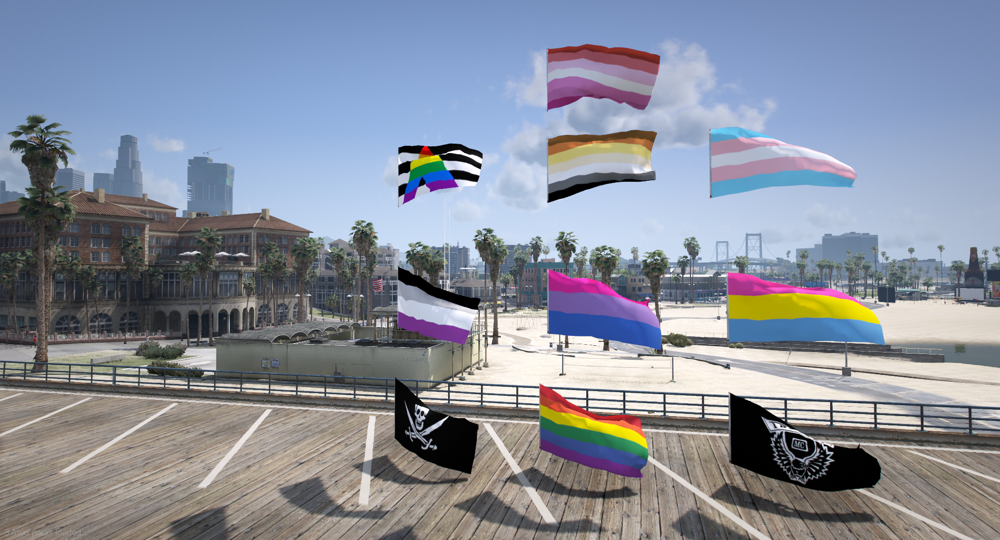

<h1 align="center">Tay's Flags 🏳️‍🌈🏳️‍⚧️</h1>

<h2 align="center"> Add On Flags For Single Player & FiveM </h2>

**Thanks for downloading and checking out my flag pack!**

This is a little project I slapped together after I wanted to figure out how I could make addon flags, as codewalker only seems to allow you to add YDR files to a YTYP, therefore I had to find and modify a YTYP file for the existing flags.
---------------------------------------

<h1 align="center">FEATURES 🌟:</h1>

<b>Ally - prop_flag_ally</b>

<b>ASEXUAL - prop_flag_asexual</b>

<b>BEAR - prop_flag_bear</b>

<b>BISEXUAL - prop_flag_bisexual</b>

<b>LESBIAN - prop_flag_lesbian</b>

<b>TRANSGENDER - prop_flag_transgender</b>

<b>PANSEXUAL - prop_flag_pansexual</b>

<b>PRIDE - prop_flag_pride</b>

<b>PIRATE - prop_flag_pirate</b>

<b>THE LOST MC - prop_flag_lostmc</b>

<h1 align="center">INSTALLATION ⚙️:</h1>
<h2 align="Left:">FiveM</h2>

Simply drop the folder 'TaysFlags' into your resources folder and add 'ensure TaysFlags' in your server.cfg

You can now add these flags to your map using codewalker. Just make sure to match the [DLC Level with your FiveM gamebuild](https://forum.cfx.re/t/tutorial-forcing-gamebuilds-on-fivem/4784977).

<h2 align="Left:">Single Player</h2>

Drag and drop the mods folder inside of your GTA 5's directory, The props should now work and you can spawn them in via Menyoo, however preferably you should use Codewalker.

# Don't want pride?

Simply retexture the images found within the flag_textures.ytd file and each flag file itself. You will need to keep the flag names the same for them to work and appear in game, otherwise modify the names within the ytyp.

# License

This reposity is under the GPL GNU V3 license. All content is free of charge. If you plan to rerelease this, the bare minimum you can do is at least credit me.
